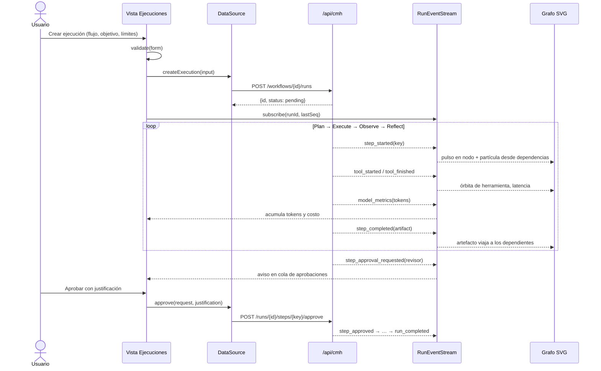
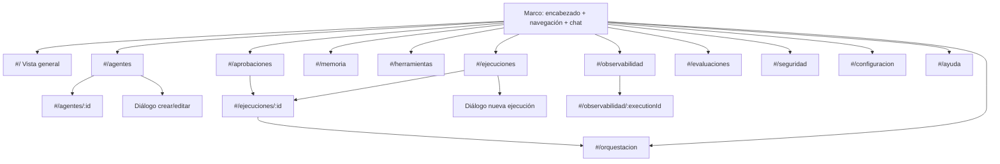

# Arquitectura — Interfaz Agentic OS CMH

Corte: 2026-09-24. Decisiones justificadas en [DECISIONS.md](DECISIONS.md).

## 1. Diagnóstico del proyecto actual

| Área | Estado medido |
|---|---|
| Plataforma | Odysseus (fork), FastAPI + SQLite + autenticación por cookie; rama `dev`, HEAD `6db87031`. |
| Frontend existente | JS nativo sin empaquetador. Vista CMH: `static/cmh-control.{html,js,css}` (4,6 KB + 13,4 KB + 1,9 KB), un solo archivo JS minificado a mano, sin tipos ni pruebas de interfaz. |
| Backend CMH | `routes/cmh_control_routes.py` (proyectos, agentes), `routes/cmh_workflow_routes.py` (definiciones DAG, ejecuciones, parar/reanudar/aprobar, SSE con `Last-Event-ID`), `routes/cmh_memory_routes.py` (archivos de memoria, propuestas con diff, aprobar/rechazar/restaurar). |
| Otros backends útiles | `/api/model-endpoints` (sin clave en claro), `/api/mcp/servers` y `/api/mcp/tools` (admin; **`env` puede traer secretos**), `/api/session` + `/api/chat`. |
| Pruebas | 5 módulos pytest CMH; ninguna prueba de JS de la vista CMH. |
| Herramientas locales | Sin Node/npm/Playwright. Disponibles: Node 24 de VS Code (Electron), TypeScript 6.0.3 de VS Code, Edge con DevTools Protocol, Python 3.13 del venv. |
| Seguridad | CSP: `script-src 'self' 'nonce-…'`, `connect-src 'self'`. APIs CMH solo admin. |
| Huecos | Sin evaluaciones, sin políticas de seguridad editables, sin presupuesto/timeout por ejecución (el bucle usa `max_steps=12` fijo), sin rechazo de paso (solo detener). |

## 2. Arquitectura objetivo

```mermaid
flowchart LR
  subgraph Browser["Navegador · /cmh/os"]
    Main[main.js] --> Router[core/router]
    Main --> Prefs[core/prefs]
    Router --> Views[views/*]
    Views --> Components[components/*]
    Views --> Services
    Components --> DOM[core/dom h&#40;&#41; solo texto]
    subgraph Services["services/"]
      Source[source.js · DataSource]
      Live[live.js · LiveSource]
      Demo[demo.js · DemoSource]
      Events[run-state.js · reductor de eventos]
      Sim[simulator.js · PRNG]
      Chat[chat.js · comandos + LLM opcional]
      Http[http.js · timeout, reintento, errores]
    end
    Source --> Live
    Source --> Demo
    Live --> Http
    Demo --> Mocks[mocks/data.js]
    Events --> Sim
    Chat --> Source
  end
  Http -->|same-origin fetch| API
  Events -->|EventSource SSE| API
  subgraph Server["Odysseus FastAPI"]
    API["/api/cmh/* · /api/model-endpoints · /api/mcp/* · /api/session · /api/chat · /api/cmh/os/config"]
    API --> DB[(SQLite)]
    API --> Vault[(Archivos CMH · fuente de verdad)]
  end
```



### Módulos y responsabilidades

| Módulo | Responsabilidad | No hace |
|---|---|---|
| `core/dom.js` | `h(tag, props, ...children)` que crea nodos y asigna texto; manejo de eventos | Nunca `innerHTML` |
| `core/router.js` | Parseo de `#/ruta/:param`, navegación, foco al cambiar de vista | Lógica de negocio |
| `core/prefs.js` | Preferencias del usuario con saneamiento (tema, movimiento, límites, flags) | Datos de negocio |
| `core/log.js` | Registro estructurado de la sesión (nivel, módulo, mensaje) | — |
| `core/i18n.js` + `i18n/es.js` | `t(clave, vars)`; todo texto visible pasa por aquí | — |
| `core/format.js` | Fechas, duraciones, números y moneda `es-PE` | — |
| `core/validate.js` | Validación de formularios y de respuestas (esquemas declarativos) | — |
| `core/storage.js` | Preferencias en `localStorage` con `try/catch` | Datos de negocio |
| `core/audit.js` | Registro de auditoría local de decisiones humanas (marcado «local») | Sustituir auditoría de servidor |
| `services/derive.js` | Reglas derivadas compartidas: nivel de permisos, riesgo, aptitud para flujos | — |
| `services/run-feed.js` | Instantánea + stream de una ejecución: sin doble conteo, cierre garantizado, recarga del artefacto que el evento real solo referencia | Renderizar |
| `i18n/server-es.js` | Traducción al español de los mensajes de error del backend | — |
| `services/run-state.js` | Reductor puro de eventos a estado de ejecución y construcción de trazas | Efectos |
| `services/http.js` | `fetch` con timeout, reintento con retroceso para GET idempotentes, errores tipados | Reintentar POST |
| `services/source.js` | Contrato `DataSource`, detección de modo, fábrica | — |
| `services/live.js` | Traduce `/api/*` a los contratos; descarta secretos | Inventar datos |
| `services/demo.js` + `mocks/` | Datos deterministas, operaciones en memoria, fallos inyectables | Datos reales |
| `services/simulator.js` | Ejecución simulada con límites (iteraciones, timeout, presupuesto) | — |
| `services/chat.js` | Intérprete de comandos y puente LLM opcional | Ejecutar acciones sensibles |
| `components/` | Piezas reutilizables sin conocimiento del backend | Llamar a la red |
| `views/` | Composición por página; estados carga/vacío/error/éxito | Acceso directo a `fetch` |

## 3. Estructura de carpetas

```text
static/cmh-os/
  index.html
  assets/logo-cmh.png
  css/tokens.css  base.css  components.css  views.css
  js/main.js  js/types.js
  js/core/     dom router prefs i18n format validate storage audit log
  js/i18n/     es.js
  js/services/ http source live demo run-state simulator derive chat
  js/mocks/    rng data
  js/components/ shell badge panel table modal toast states form tabs graph chat-panel timeline chart
  js/views/    overview agents executions orchestration memory tools approvals
               observability evaluations security settings help
routes/cmh_os_routes.py            # GET /api/cmh/os/config
scripts/cmh_os/                    # node.sh typecheck.mjs lint.mjs build.mjs serve.mjs check.sh
static/cmh-os/jsconfig.json        # opciones de TypeScript (strict, checkJs)
static/cmh-os/package.json         # "type": "module" para Node; sin dependencias
tests/cmh_os/unit/*.test.mjs       # node --test
tests/cmh_os/e2e/                  # cdp.mjs run.mjs (la API falsa está en scripts/cmh_os/serve.mjs --api)
tests/cmh_os/fixtures/api_samples.json  # contrato compartido con pytest
tests/test_cmh_os_routes.py        # ruta, config, contrato real ↔ fijaciones
integrations/cmh/docs/             # esta documentación
```

## 4. Contratos de datos

Definidos en `static/cmh-os/js/types.js` (JSDoc, verificados por TypeScript).
Todos los registros llevan `origin: "real" | "demo"`.

| Contrato | Campos clave | Fuente real |
|---|---|---|
| `ModelProvider` | id, name, baseUrl, status, hasKey, keyFingerprint, supportsTools, models[] | `/api/model-endpoints` |
| `AgentCapability` | id, label, description | derivado del rol / demo |
| `Agent` | id, name, role, projectId, status (`active`/`paused`/`running`/`error`), model, allowedTools[], workspace, permissionLevel (`lectura`/`escritura`/`admin`), instructions, instructionsVersion, taskId, capabilities[] | `/api/cmh/agents` |
| `Tool` | id, name, category, risk, enabled, requiresApproval, serverId?, usageCount | `READ_TOOLS` + agentes + `/api/mcp/tools` |
| `MCPServer` | id, name, transport, status, toolCount, enabledToolCount, envKeys[] (sin valores), error | `/api/mcp/servers` |
| `Workflow` | id, name, projectId, version, steps: `{key, agentId, dependsOn[], independentOf[], requiresApproval}[]` | `/api/cmh/workflows` |
| `Task` | id, title, agentId, dependsOn[], status | pasos de la ejecución |
| `Execution` | id, workflowId, projectId, objective, priority, status, createdAt, limits `{maxIterations, timeoutSeconds, budgetUsd}`, usage `{tokensIn, tokensOut, costUsd}`, steps[], artifacts[], finalAnswer, error | `/api/cmh/runs`, `/api/cmh/runs/{id}` |
| `ExecutionStep` | key, agentId, status, model, dependencies[], error, startedAt, finishedAt, tools[] | `/api/cmh/runs/{id}` + eventos |
| `RunEvent` | seq, kind, stepKey, payload, at | SSE `/api/cmh/runs/{id}/events` |
| `MemoryRecord` | id, kind (`trabajo`/`episodica`/`semantica`), title, content, source, createdAt, relevance, tags[], archived | `/api/cmh/memories`, artefactos |
| `ApprovalRequest` | id, kind (`paso`/`memoria`/`herramienta`), requestedBy, action, args, impact, risk, status, createdAt, decidedAt, justification | pasos `waiting_approval`, `/api/cmh/memory-proposals` |
| `Trace` | id, executionId, spans[] `{id, name, kind, startMs, durationMs, status, tokens, costUsd}` | eventos SSE agregados |
| `Evaluation` | id, name, dataset, cases, passed, failed, score, runAt, baselineScore | demo (sin backend) |
| `SecurityPolicy` | id, name, scope, effect, description, enforcedBy | reglas reales documentadas + demo |
| `AuditEvent` | id, at, actor, action, target, outcome, origin (`servidor`/`local`) | local + demo |

### Estados comunes de vista

`loading` → esqueleto; `empty` → mensaje y acción sugerida; `error` → causa
legible, botón «Reintentar» y detalle técnico plegable; `ready` → contenido.
Implementado una sola vez en `components/states.js` (`asyncView`).

## 5. Flujo de ejecución de un agente (vista de orquestación)



## 6. Navegación



## 7. Seguridad

- Todo texto de backend o de usuario entra al DOM como `textContent`; `lint.mjs`
  falla ante `innerHTML`, `outerHTML`, `insertAdjacentHTML`, `document.write`,
  `eval` y `new Function`.
- Sin secretos en el cliente (ADR-011). Configuración pública por
  `/api/cmh/os/config`.
- Acciones destructivas o externas (aprobar, rechazar, detener, archivar,
  activar agente, consultas al modelo) requieren confirmación explícita con
  resumen del impacto; las de riesgo alto piden justificación escrita.
- Mínimo privilegio visible: cada agente muestra su nivel de permisos derivado
  de sus herramientas; los flujos reales solo aceptan herramientas de lectura
  (`READ_TOOLS` del backend).
- Mismo origen: `connect-src 'self'`, cookies `same-origin`, sin CDN.

## 8. Observabilidad del propio frontend

- `core/audit.js` registra decisiones humanas con marca de tiempo, actor y
  resultado (origen «local»).
- `services/http.js` mide latencia por llamada y la expone en Observabilidad
  («Llamadas de esta sesión»).
- Errores no capturados → `window.onerror`/`unhandledrejection` → aviso visible
  y registro en consola estructurado (`{nivel, modulo, mensaje}`).

## 9. Despliegue

Sin paso de build: los archivos de `static/cmh-os/` se sirven tal cual. En
Docker, el `Dockerfile` existente ya copia `static/`; no requiere cambios.
Activación: `CMH_OS_UI_ENABLED=true` (por defecto).
