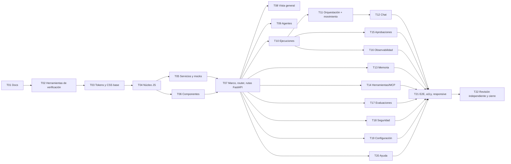

# Plan de implementación — Interfaz Agentic OS CMH

Corte: 2026-09-24. Estado vivo de cada tarea: [IMPLEMENTATION_STATUS.md](IMPLEMENTATION_STATUS.md).
Arquitectura: [ARCHITECTURE.md](ARCHITECTURE.md) · Decisiones: [DECISIONS.md](DECISIONS.md) ·
UX: [UI_UX_SPECIFICATION.md](UI_UX_SPECIFICATION.md) · Pruebas: [TEST_PLAN.md](TEST_PLAN.md).

## 1. Tecnologías

| Elegida | Para qué | Justificación |
|---|---|---|
| HTML + CSS + módulos ES nativos | Toda la interfaz | Convención de Odysseus; sin empaquetador; CSP |
| JSDoc + TypeScript 6.0.3 (`checkJs`, `strict`) | Tipado estricto | Tipos sin transpilar; TypeScript ya está en la máquina |
| SVG propio | Grafo, gráficos | Accesible, escalable, sin dependencias |
| `EventSource` nativo | Eventos en vivo | El backend ya expone SSE con `Last-Event-ID` |
| `<dialog>` nativo | Modales | Foco y Esc gestionados por el navegador |
| FastAPI (existente) | Servir `/cmh/os` y `/api/cmh/os/config` | Reutiliza autenticación y CSP |
| `node --test` (Node 24 de VS Code) | Unitarias | Sin instalar |
| Edge + DevTools Protocol | Componentes, integración, e2e, capturas | Sin instalar |
| pytest | Rutas y contrato | Ya en el proyecto |

| Descartada | Motivo |
|---|---|
| React/Vite/TS con npm | No hay npm; añadiría cadena de build y dependencias |
| React Flow, D3, Chart.js | Exigen React o no son necesarias; CSP sin CDN |
| Tailwind | Requiere build; los tokens CMH ya definen el sistema |
| Playwright, Cypress, Jest, Vitest, ESLint | Requieren npm/pip nuevos (ADR-009) |
| WebSockets propios | SSE ya existe y basta |

## 2. Orden exacto y dependencias

## 3. Tareas

Complejidad: S (< 1 h), M (1–3 h), L (> 3 h). Prioridad: P0 imprescindible, P1 alcance, P2 mejora.

### T01 · Investigación y planificación — P0 · M
- **Objetivo**: documentos de investigación, arquitectura, UX, decisiones, pruebas.
- **Archivos**: `integrations/cmh/docs/*.md`.
- **Dependencias**: ninguna. **Pasos**: inspección del repo, investigación de licencias, redacción.
- **Pruebas**: revisión de enlaces internos. **Fin**: 9 documentos presentes.
- **Riesgos**: especificación ausente (ADR-000).

### T02 · Herramientas de verificación — P0 · M
- **Objetivo**: typecheck, lint, build, servidor estático y ejecutor sin instalar nada.
- **Archivos**: `scripts/cmh_os/{node.sh,typecheck.mjs,lint.mjs,build.mjs,serve.mjs,check.sh}`, `static/cmh-os/jsconfig.json`.
- **Pasos**: localizar Node/TS de VS Code; configurar `strict`; reglas de lint; grafo de módulos.
- **Pruebas**: cada script falla con un archivo defectuoso de prueba y pasa con uno correcto.
- **Fin**: `check.sh` ejecuta todo y devuelve código ≠ 0 ante el primer fallo.
- **Riesgos**: VS Code se actualiza y cambia la ruta → el wrapper busca la versión por patrón.

### T03 · Tokens y CSS base — P0 · M
- **Archivos**: `css/tokens.css`, `css/base.css`, `css/components.css`.
- **Pasos**: tokens CMH, tema claro/oscuro, reset, tipografía, componentes.
- **Pruebas**: unitaria de contraste sobre los pares de tokens (`contrast.test.mjs`).
- **Fin**: 0 pares por debajo de AA. **Riesgo**: oro sobre claro (regla CMH).

### T04 · Núcleo JS — P0 · M
- **Archivos**: `js/core/*`, `js/i18n/es.js`, `js/types.js`.
- **Pruebas**: `router`, `validate`, `format`, `i18n`, `storage` unitarias.
- **Fin**: typecheck 0 errores. **Riesgo**: `h()` debe impedir HTML.

### T05 · Servicios, mocks y simulador — P0 · L
- **Archivos**: `js/services/*`, `js/mocks/*`.
- **Pasos**: contrato `DataSource`; `LiveSource` sobre `/api/*`; `DemoSource` determinista; `RunEventStream`; simulador con límites; filtros de secretos; fallos inyectables.
- **Pruebas**: `live.test.mjs` (fetch falso, mapeo, secretos), `demo.test.mjs`, `simulator.test.mjs` (determinismo, presupuesto, timeout, iteraciones), `http.test.mjs` (timeout, reintento).
- **Fin**: mismas firmas en ambos adaptadores (verificado por tipos y prueba).
- **Riesgo**: divergencia real ↔ fijación → prueba de contrato en T07.

### T06 · Componentes — P0 · L
- **Archivos**: `js/components/*`.
- **Pruebas**: pruebas de componentes en navegador (e2e runner, sección «componentes»).
- **Fin**: cada componente con estado vacío/error donde aplica.

### T07 · Marco, router y rutas FastAPI — P0 · M
- **Archivos**: `static/cmh-os/index.html`, `js/main.js`, `components/shell.js`, `app.py` (+3 líneas), `routes/cmh_os_routes.py`, `.env.example` (+2 variables), `tests/test_cmh_os_routes.py`, `tests/cmh_os/e2e/fixtures/*.json`.
- **Pruebas**: pytest (ruta servida, flag apagado → 404, config sin secretos, contrato de claves reales = fijaciones).
- **Fin**: `/cmh/os` carga en modo demo sin backend y en modo real con sesión.

### T08–T20 · Vistas — P1 · M–L cada una
- **Archivos**: `js/views/<vista>.js` (+ estilos en `views.css`).
- **Pruebas**: e2e del flujo de cada vista; estados carga/vacío/error.
- **Fin**: criterios de la sección 4 del UX para esa página.
- **Riesgos**: T11 (animación y rendimiento) y T12 (LLM opcional) son las de mayor riesgo.

### T21 · End-to-end, accesibilidad y responsive — P0 · L
- **Archivos**: `tests/cmh_os/e2e/*`.
- **Pruebas**: 10 flujos obligatorios; a11y básica en cada ruta; capturas 390/820/1440; sin desbordamiento horizontal.
- **Fin**: 0 fallos; capturas guardadas en `data/cmh-os-screens/` (ignorado por git).

### T22 · Revisión independiente y cierre — P0 · M
- **Pasos**: revisión por subagente sin razonamiento del constructor; corregir; `IMPLEMENTATION_STATUS.md`; registro `ESTADO_AGENTIC_OS.md`; ficha del vault.
- **Fin**: veredicto sin críticos abiertos; checks verdes.

## 4. Criterios de aceptación verificables

| # | Criterio | Cómo se verifica |
|---|---|---|
| A1 | Instala con el procedimiento documentado | No hay instalación: `check.sh` corre en una máquina con VS Code y Edge |
| A2 | Inicia correctamente | e2e abre `/cmh/os` y encuentra el marco y la vista general |
| A3 | 0 rutas rotas | e2e visita las 14 rutas; cada una renderiza su `h1` y sin error |
| A4 | Responsive | e2e a 390/820/1440: `scrollWidth ≤ innerWidth` en todas las rutas |
| A5 | Formularios validan | e2e envía formularios vacíos o inválidos y encuentra `aria-invalid` |
| A6 | Estados de error | e2e con fallo inyectado: aparece el error y el reintento recupera |
| A7 | Lint 0 | `lint.mjs` código 0 |
| A8 | Tipos 0 | `typecheck.mjs` código 0 |
| A9 | Pruebas esenciales pasan | `node --test` + e2e + pytest, conteos en STATUS |
| A10 | Build | `build.mjs` código 0 y manifiesto |
| A11 | Sin secretos | `lint.mjs` busca patrones de clave; prueba de filtrado de `env` |
| A12 | Datos ficticios identificados | e2e: en modo demo, franja visible y cada panel con insignia |
| A13 | Licencias documentadas | `LICENSES_AND_ATTRIBUTIONS.md` |
